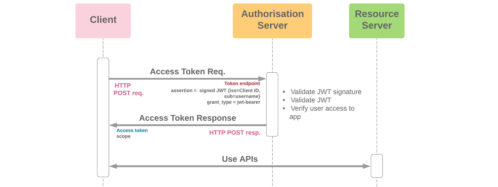

# Spring Boot Assignment

This project is a small web service (REST API) developed using Java 21 with Spring Boot 3.2.5, employing an H2 database for quick setup and testing. The assignment involves implementing JWT (JSON Web Token) security to safeguard resources from unauthorized access.

## Technologies Used

- Java 21
- Spring Boot Framework 3.2.5
- H2 Database
- Maven Build Tool
- Intellij IDEA

## Project Structure

- **Source Code:** The provided Spring Boot project contains the following resources:
    - Admin/Login API
    - User/List API
    - User/Add New Account API

## Postman Collection and Environment

To facilitate testing and interaction with the Spring Boot project, we have provided a Postman collection along with a corresponding environment file.

### Postman Collection

- **File Name:** [admin-test-api.postman_collection.json](admin-test-api.postman_collection.json)
- **Description:** This collection contains three APIs for testing:
    1. Admin/Login
    2. User/List
    3. User/Add New Account

### Environment File

- **File Name:** [Local - Admin Test API.postman_environment.json](Local%20-%20Admin%20Test%20API.postman_environment.json)
- **Description:** This environment file is configured for local testing of the APIs within the Spring Boot project.

## Assignment Details

The assignment requires implementing JWT security to ensure that only authorized users can access the resources. Here are the specific requirements:

1. **Admin/Login API:** Upon successful authentication, the administrator should receive a JWT Token along with account details.
2. **User/Add New Account API:** When the administrator calls this API, the current logged-in admin's username and ID should be logged out.

## Implementation Guidelines

- All APIs except Admin/Login should be secured with JWT tokens.
- Sensitive data should not be stored in the JWT body.